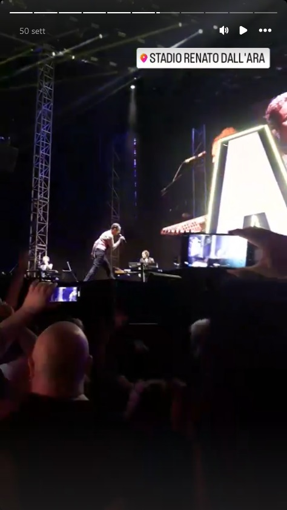

# enjoythefansale

## Cosa dovrebbe fare questo software?

Nel 2023 _un mio amico_ ha cercato di acquistare i biglietti prato per il concerto dei Depeche Mode allo Stadio Dall'Ara a Bologna il 16 Luglio, sold out da mesi. Tutte le offerte di biglietti pubblicate su Fansale, il canale di rivendita secondaria e ufficiale di Ticketone, duravano lo spazio di qualche minuto. Guardare di tanto in tanto il sito non serviva a niente, gli avvisi via mail erano poco efficaci perchè non in tempo reale, il tempo per monitorare costantemente il sito era pari a zero.

Provando a verificare le offerte relative a un altro concerto e con un po' di reverse engineering sul traffico di rete _il mio amico_ ha scoperto che il link delle offerte di ogni evento è costruito sulla falsariga di:

```
https://www.fansale.it/tickets/all/<artist>/<id_artist>/<id_event>
```

dove:
* `artist` è l'identificativo human-readable dell'artista o del gruppo (es.: depeche-mode)
* `id_artist` è l'identificativo numerico dell'artista o del gruppo (es.: 459359)
* `id_event` è l'identificativo numerico dell'evento (es.: 15946075) 

I primi due campi si ottengono ricercando l'artista o il gruppo dalla casella di ricerca su `https://www.fansale.it/`. Il terzo campo si ottiene ricercando l'evento su `https://www.ticketone.it` e aprendo la relativa pagina di acquisto biglietti, ottenendo un link del tipo `https://www.ticketone.it/event/artist-location-15946075/`.

Chiamando questa prima pagina si ottiene un ID di sessione, utilizzabile per contattare la successiva API REST con tutte le offerte relative all'evento, ovvero `https://www.fansale.it/fansale/json/offer/<id_event>`. Avviando il software a intervalli predeterminati si è pertanto in grado di verificare le offerte con regolarità durante la giornata, ricevendo una notifica su Telegram nel caso in cui vi sia una differenza tra le offerte disponibili all'istante X e quelle disponibili all'istante X+1.

## Compra anche il biglietto in automatico?

No, per una serie di motivi. 

Il primo è che _il mio amico_ voleva solo essere notificato per tempo quando un biglietto era disponibile, per poi decidere se comprarlo. Il secondo motivo è che non avrebbe comunque avuto tutti i soldi per comprare ogni biglietto, per poi magari rivenderli a prezzo maggiorato come facevano [alcuni siti di secondary ticketing](https://www.iene.mediaset.it/video/viviani---de-devitiis-come-funziona---davvero---il-business-dei-biglietti_70236.shtml) e come tuttora fa qualche privato sui social network (quando va bene e non scappa con i soldi senza inviarti alcun biglietto). Il terzo è che crede che eticamente non sia corretto prendere più di quello che gli occorre, indipendentemente dal fatto che sia gratis o a pagamento. 

Il quarto è che nessuno viene guardato male se entra in un negozio di articoli per la casa e acquista un coltello: è molto più facile che sia utilizzato per tagliare una bistecca anzichè per violare il codice civile o penale. Allo stesso modo un bot può aiutare ogni venti minuti _il mio amico_ ad andare a vedere il suo primo concerto dei Depeche Mode oppure essere usato per l'acquisto massivo dei biglietti [in contrasto con la Legge Battelli](https://www.camera.it/leg17/995?sezione=documenti&tipoDoc=lavori_testo_pdl&idLegislatura=17&codice=17PDL0049830&back_to=https://www.camera.it/leg17/126?tab=2-e-leg=17-e-idDocumento=4269-e-sede=-e-tipo=). 

## Cosa potrebbe fare questo software oggi?

Niente. A differenza di allora, è stato implementato un sistema anti-bot basato su Akamai, a occhio sono leggermente cambiate le API REST e _al mio amico_ comincia a passare la voglia di andare ai concerti per tutta una serie di ragioni che passano dalla speculazione sull'acqua (non sulla birra, sull'acqua) alle prevendite che aprono [più di un anno prima](https://tg24.sky.it/spettacolo/musica/2024/04/19/tour-marracash-stadi).

Avendo tempo e voglia si potrebbe riscrivere tutto basandosi su un browser headless e studiandosi [questo](https://www.zenrows.com/blog/bypass-akamai). C'è chi forse l'ha già fatto e si fa pagare un minimo di 6 euro al mese per ricercare i biglietti in automatico al posto vostro, senza nemmeno fornirvi la garanzia di acquisto. Che dire.

## Ma _il tuo amico_ alla fine ce l'ha fatta a vedere i Depeche Mode?


